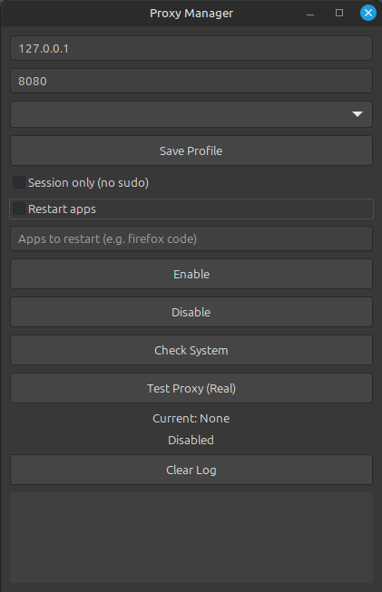

# Proxy Manager

GTK-based GUI tool to manage system proxy on Linux.

## Screenshot

## Features
- Enable / Disable proxy
- Session mode (no sudo)
- System mode (APT + Git support)
- Proxy test (real IP detection)
- Notifications
- Saved profiles
- Restart apps option

## Install

Download `.deb` and install:

sudo dpkg -i proxy-manager.deb

## Run

Search "Proxy Manager" in your system menu

## Notes

- Session mode does NOT affect APT
- Proxy must be running (e.g. 127.0.0.1:8080)
